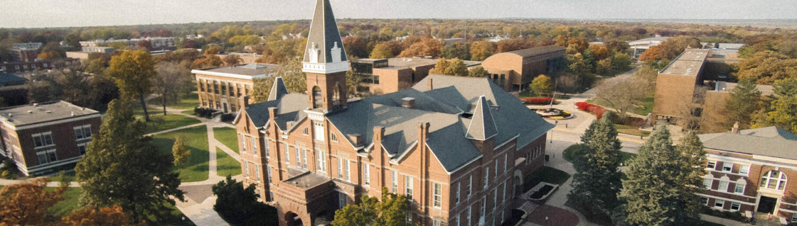

<style type="text/css">
.main-container {
  max-width: 1600px;
  margin-left: auto;
  margin-right: auto;
}

@media screen and (min-width: 850px) {
#TOC {
  position: fixed;
  left: 0;
  bottom: 0;
  display: block;
  /* border-radius: 3px; */
  width: 100vw;
  height:60px;
  background-color: rgba(55, 71, 79, 1);
  vertical-align:middle;
  padding-left:10px;
  padding-top: 18px;
  padding-bottom: 18px;
  z-index: 9999;
}
#TOC:hover {
  /* background-color: rgba(55, 71, 79,1); */
}
.toc-item {
  color: white; 
  line-height: 24px; 
  font-size: 20pt; 
  display: inline-block;
  font-weight: 500;
  width:33%;
  text-align: center;
  
}
.toc-item:hover {
  text-decoration: none;
  color: #80DEEA;
}
}

@media screen and (max-width: 849px) {
#TOC {
  position: fixed;
  left: 0;
  bottom: 0;
  display: block;
  /* border-radius: 3px; */
  width: 100vw;
  background-color: rgba(55, 71, 79, 1);
  vertical-align:middle;
  padding-left:10px;
  padding-top: 18px;
  padding-bottom: 18px;
  z-index: 9999;
}
#TOC:hover {
  /* background-color: rgba(55, 71, 79,1); */
}
.toc-item {
  color: white; 
  line-height: 24px; 
  font-size: 16pt; 
  display: block;
  font-weight: 500;
  
}
.toc-item:hover {
  text-decoration: none;
  color: #80DEEA;
}
}


.target-pos {
  text-decoration: none !important;
}
.fp-date {
  font-size: 18pt;
  font-color: #f57c00;
}
.tab-dates {
  display: none;
  font-size: 20 pt;
  font-weight: 600;
}
.guidebox{
  border: 1px solid;
  border-radius: 3px;
  border-color: grey;
  display: block;
  margin-top: 5px;
  margin-bottom: 5px;
  padding: 5px;
  width: 100%;
}

@media print {
  .level2.active > .level3 > .tab-content > .tab-pane {
    display: block !important;
    opacity: 1;
  }
  /* do not show table of contents */
  #TOC {
    display: none !important;
  }
  /* do not show tabset navigation */
  .level2.active > .level3 > ul.nav {
    display: none !important;
  }
  .level2.active .tab-dates {
    display: block !important;
  }
  .print-btn-wrap {
    display: none !important;
  }
  #select_tz_txt{
    display:none !important;
  }
  .guidebox{
    display: none !important;
  }
  .customizable-text {
    display: none !important;
  }
  .tz-info{
    display: none !important;
  }
}
.print-btn {
  width: 160px;
  height: 25px;
  display: inline-block;
  border-radius: 3px;
  background-color: rgb(0,121,107);
  vertical-align:middle;
  padding-left:10px;
  margin-right:10px;
}
.print-btn-wrap {
  display: block;
  border-radius: 3px;
  vertical-align:middle;
}
.logo {
  width: 100%; 
  height: 100%;
  object-fit: cover;
  object-position: 50% 50%;
}

a {
  color: #00695C;
}

.toshow {
  display: block !important;
  opacity: 1;
} 

.tohide {
  display: none ! important;
}

#header {
  display: none !important;
}

.customizable-text{
  display: inline-block;
}

</style>

```{r setup, include=FALSE}
knitr::opts_chunk$set(echo = TRUE)
library(readr)
library(lubridate)
library(kableExtra)
library(huxtable)
options(knitr.kable.NA = "")
```
<center></center>
<br>
<center> <strong><p style = 'font-size: 28pt'>Program Book for Actuarial Research Conference 2023</p></strong></center>

<div class = "guidebox">

<div class = "print-btn-wrap"><button onclick="window.print();return false;" class = "print-btn">
<p style="color: white">Print This Page</p>
</button><p style = "display: inline-block">Use this button to print the program book or save it as PDF.</p></div>

<div class = "print-btn-wrap" id = "expand-date"><button onclick="expandDate();" class = "print-btn">
<p style="color: white">Expand Date Tabs</p>
</button><p style = "display: inline-block">To search for a particular entry with some key words of the whole program book, click on this button and then use Control+F (or Command+F on a Mac) to search.</p></div>

<div class = "print-btn-wrap" id = "collapse-date" style = "display:none;"><button onclick="collapseDate();" class = "print-btn">
<p style="color: white">Collapse Date Tabs</p>
</button><p style = "display: inline-block">Click this button again to collapse date tabs for conciseness.</p></div>

<!-- <div class = "print-btn-wrap"><a href="https://custom.cvent.com/56F6596CA8CC454DA87ED2BDA51F6221/files/event/83062796601c45d8aa3f928b21069cbc/d346e6e291814efda3b391e658510cc6.pdf" target = "_black"><button class = "print-btn"> -->
<!-- <p style="color: white">Instruction</p> -->
<!-- </button></a><p style = "display: inline-block">Click on this button for more detailed instructions on how to use this program book.</p></div> -->

</div>
<div>


<div id="TOC">
<a href="#outline-anchor" class="toc-item">| PROGRAM OUTLINE</a>
<a id = "fplink" href="#full-program" class="toc-item">| DETAILED AGENDA</a>
<a href="#talk-abstracts" class="toc-item">| ABSTRACT BOOK</a>
</div>

<script>
window.onload = function(){
    <!-- if no time zone choices needed -->
    $('#section > ul').css("display", "none");
    var active_tab = $('#section > .nav-tabs > .active > a').text();
    var active_tab_id = active_tab.replaceAll(/[+(),]/g, "").replaceAll(" ", "-").toLowerCase();
    var active_date = $("#" +active_tab_id + " > .tabset > .nav-tabs > .active > a").text();
    var link = document.getElementById("fplink");
    link.setAttribute("href", "#"+active_tab+"-"+active_date+"-full-program");
    var dd = document.getElementById("section");
    dd.addEventListener('DOMSubtreeModified', function () {
    var expand_btn = document.getElementById("expand-date");
    expand_btn.classList.remove("tohide");
    var collapse_btn = document.getElementById("collapse-date");
    collapse_btn.classList.remove("toshow");
    active_tab = $('#section > .nav-tabs > .active > a').text();
    active_tab_id = active_tab.replaceAll(/[+(),]/g, "").replaceAll(" ", "-").toLowerCase();
    if (active_tab_id !== ""){
        active_date = $("#" +active_tab_id + " > .tabset > .nav-tabs > .active > a").text();
        link.setAttribute("href", "#"+active_tab+"-"+active_date+"-full-program");
    }
    //var dt = document.getElementById(active_tab_id);
   // dt.addEventListener('DOMSubtreeModified', function(){
   //     active_tab = $('#section > .nav-tabs > .active > a').text();
    //    active_tab_id = active_tab.replaceAll(/[+(),]/g, "").replaceAll(" ", "-").toLowerCase();
    //    active_date = $("#" +active_tab_id + " > .tabset > .nav-tabs > .active > a").text();
   // link.setAttribute("href", "#"+active_tab+"-"+active_date+"-full-program");
    //});
    });
    //dt.addEventListener('DOMSubtreeModified', function(){
    //    active_tab = $('#section > .nav-tabs > .active > a').text();
    //active_date = $("#program-outline > .nav-tabs > .active > a").text();
    //link.setAttribute("href", "#"+active_tab+"-"+active_date+"-full-program");
    //});
};
expandDate = function(){
  var tabs = document.querySelectorAll(".level2.active > .level3 > .tab-content > .tab-pane");
  tabs.forEach(function(item){item.classList.add("toshow")});
  var tabnav = document.querySelector(".level2.active > .level3 > ul.nav");
  tabnav.classList.add("tohide");
  var tabnames = document.querySelectorAll(".level2.active .tab-dates");
  tabnames.forEach(function(item){item.classList.add("toshow")});
  var expand_btn = document.getElementById("expand-date");
  expand_btn.classList.add("tohide");
  var collapse_btn = document.getElementById("collapse-date");
  collapse_btn.classList.add("toshow");
}
collapseDate = function(){
  var tabs = document.querySelectorAll(".level2.active > .level3 > .tab-content > .tab-pane");
  tabs.forEach(function(item){item.classList.remove("toshow")});
  var tabnav = document.querySelector(".level2.active > .level3 > ul.nav");
  tabnav.classList.remove("tohide");
  var tabnames = document.querySelectorAll(".level2.active .tab-dates");
  tabnames.forEach(function(item){item.classList.remove("toshow")});
  var expand_btn = document.getElementById("expand-date");
  expand_btn.classList.remove("tohide");
  var collapse_btn = document.getElementById("collapse-date");
  collapse_btn.classList.remove("toshow");
}
</script>


```{r tz_dict, include=FALSE}
tz_dict <- readRDS('saved_tables/timezones.rds')
```

```{r echo=FALSE, results='asis'}
ol_bytz <- readRDS("saved_tables/outline_bytimezone.rds")
```

```{r full_program, echo=FALSE, results='asis'}
fp_bytz <- readRDS("saved_tables/full_program_bytimezone_date.rds")
```

<!-- <h3 id = "select_tz_txt"><strong>Select Your Time Zone</strong></h3> -->
<!-- <p class = "tz-info">For more information about your UTC time zone, please click <a href = "https://24timezones.com/timezone-map" target = "_black">here</a>.</p> -->
<!-- Annoucement area -->
<h3>Shuttle Services</h3>
<p>Shuttle services are provided on 7/31, 8/1, and 8/2 for trips between hotels, Drake University, and tour and banquet sites. For details, please refer to <a href="https://arc2023.wp.drake.edu/shuttle-schedule/">https://arc2023.wp.drake.edu/shuttle-schedule/</a>.</p>
<h3>WiFi Access</h3>
<p>If you have EDUROAM access, please see: <a href="https://drake.teamdynamix.com/TDClient/2025/Portal/KB/ArticleDet?ID=84019">https://drake.teamdynamix.com/TDClient/2025/Portal/KB/ArticleDet?ID=84019</a>.</p>
<p>For Drake's guest network, please see: <a href="https://drake.teamdynamix.com/TDClient/2025/Portal/KB/ArticleDet?ID=21332">https://drake.teamdynamix.com/TDClient/2025/Portal/KB/ArticleDet?ID=21332</a>.</p>
<a name = "outline-anchor"></a>
```{r output, eval=FALSE, include=FALSE, results='asis'}
cat("\n#", "{.tabset .tabset-dropdown}", "\n")
for (i in 1:length(ol_bytz)) {
  cat("\n##", names(ol_bytz)[i], "\n")
  cat("\n###", "Program Outline", "{.tabset}", "\n")
  outline_bydate <- ol_bytz[[i]]
  for (j in 1:length(outline_bydate)) {
    cat("\n####", outline_bydate[[j]]$ol_date, "\n")
    cat("\n<p class = 'tab-dates' >", outline_bydate[[j]]$ol_date, "</p>\n")
    print(outline_bydate[[j]]$ol_table)
    cat("---")
    cat("\n")
  }
  cat("\n###", "Full Program", "\n<a name='full-program'></a>")
  fp_bysession <- fp_bytz[[i]]
  for (j in 1:length(fp_bysession)) {
    print_html(fp_bysession[[j]]$ss_table)
    cat("---")
    cat("\n")
  }
}
```

```{r output_fp_attached_to_ol, echo=FALSE, results='asis'}
cat("\n#", "{.tabset .tabset-dropdown}", "\n")
for (i in 1:length(ol_bytz)) {
  cat("\n##", names(ol_bytz)[i], "\n")
  cat("\n###", "Program Outline", "{.tabset}", "\n")
  outline_bydate <- ol_bytz[[i]]
  fp_bydate <- fp_bytz[[i]]
  for (j in 1:length(outline_bydate)) {
    cat("\n####", outline_bydate[[j]]$ol_date, "\n")
    cat("\n<p class = 'tab-dates' style = 'font-size: 18pt; font-weight: 500;'>", outline_bydate[[j]]$ol_date, "</p>\n")
    print(outline_bydate[[j]]$ol_table)
    cat("---")
    cat("\n")
    cat(paste0("\n<a name='", names(ol_bytz)[i], "-", outline_bydate[[j]]$ol_date, "-full-program'></a>"))
    # cat("\n<a name='full-program'></a>")
    cat("\n<p style = 'font-size: 16pt'> Detailed Agenda </p>")
    ss <- fp_bydate[[j]]
    for (k in 1:length(ss)){
        print_html(ss[[k]]$ss_table)
    }
    cat("---")
    cat("\n")
  }
  # cat("\n###", "Full Program", "\n<a name='full-program'></a>")
  # fp_bysession <- fp_bytz[[i]]
  # for (j in 1:length(fp_bysession)) {
  #   print_html(fp_bysession[[j]]$ss_table)
  #   cat("---")
  #   cat("\n")
  # }
}
```

#

<a name = 'talk-abstracts'></a>

# Abstract Book

```{r abstract_table, echo=FALSE, results='asis'}
abs_table <- readRDS("saved_tables/abstracts.rds")
print_html(abs_table)
```

<div style = "padding-bottom: 80px"></div>